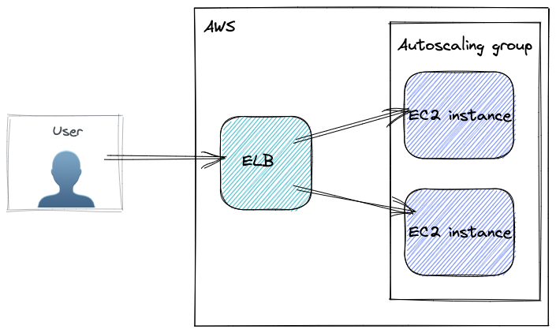

# Terraform training files.

## O'Reilly Terraform Up & Running 2nd Edition

### Prerquisities

- AWS account
- Default VPC with default subnets

### Chapter 2 Webserver with autoscale and ALB

- Simple t2.micro Ubuntu instanc with busybox web listner.
- Local state.



### Chapter 3 Remote state and MySql

- Backend S3 configuration, optional
- For training configuration keep using local state.
- Created a `backend.hcl` configuration file. To use it remove all
    parameters excep "key" from the backend configuration.
    Whenever you need to run terraform init use this form:
    ```bash terraform init -backend-config=backend.hcl```
- isolating state files per layout
- add RDS database
- import user data


